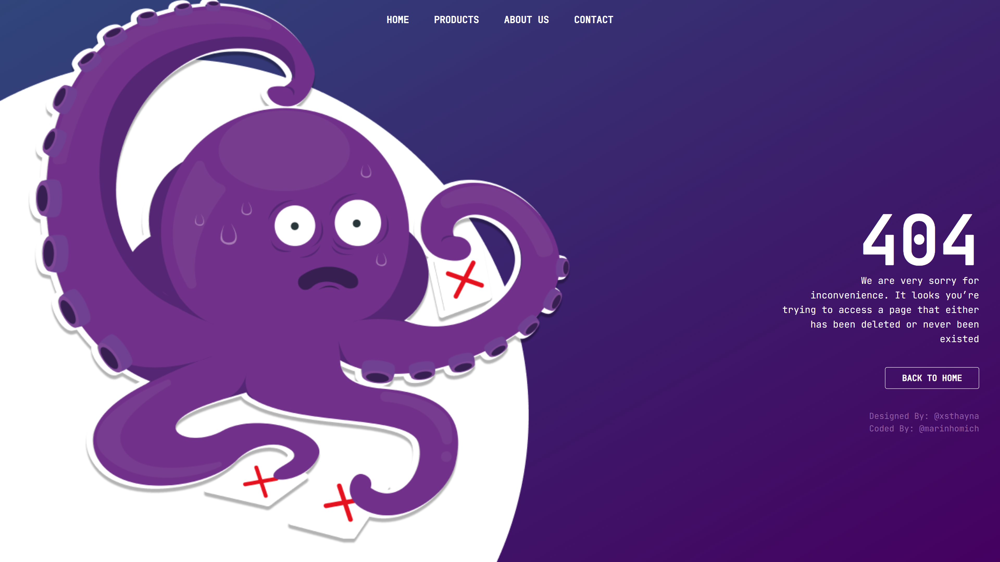

<h1 align="center">
  
  <br>Page 404
</h1>

<p align="center">
   A Custom Page 404 Error
</p>



```sh
# install dependencies
> npm install

# start project
> npm run dev

```

## Preview

🔗 https://404.marinhomich.dev
